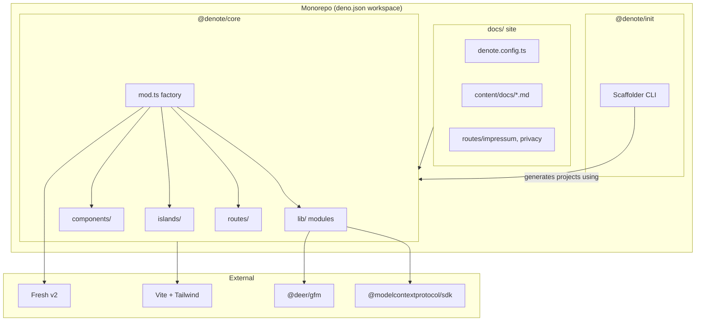
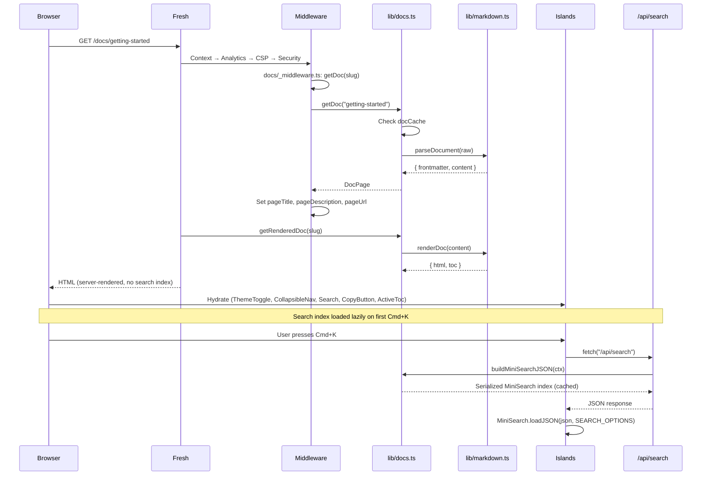
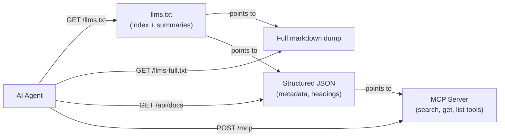
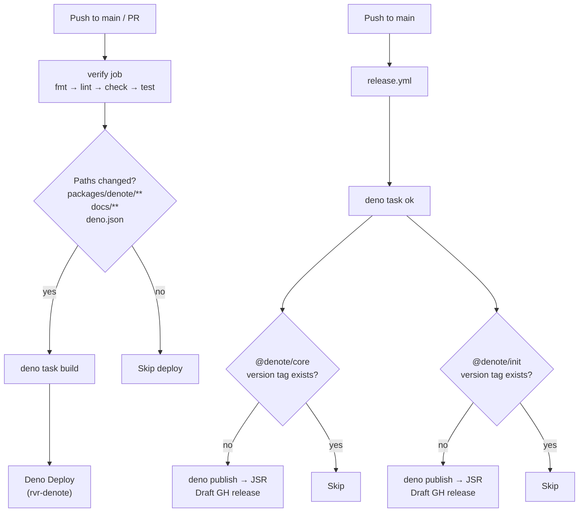

# Codebase Map

> Auto-generated by Cartographer. Last mapped: 2026-03-02

## System Overview



## Directory Structure

```
/                                   Monorepo root (@denote/monorepo)
├── packages/
│   ├── denote/                     @denote/core — the documentation framework
│   │   ├── mod.ts                  Package entry: denote() factory + re-exports
│   │   ├── denote.config.ts        All DenoteConfig type definitions
│   │   ├── utils.ts                DenoteContext, State, define helper
│   │   ├── validate.ts             CLI validation script entry
│   │   ├── vite.ts                 Vite HMR plugin for config hot-reload
│   │   ├── styles.css              Base design system (CSS custom properties)
│   │   ├── lib/
│   │   │   ├── config.ts           Singleton config registry (get/set + Zod validation)
│   │   │   ├── docs.ts             Doc loading, caching, search index, file watcher
│   │   │   ├── markdown.ts         Frontmatter parsing + markdown→HTML rendering
│   │   │   ├── ai.ts               llms.txt, llms-full.txt, /api/docs JSON
│   │   │   ├── mcp.ts              MCP server factory (search, get, list tools)
│   │   │   ├── analytics.ts        Server-side analytics middleware (Umami/Plausible)
│   │   │   ├── csp.ts              Content Security Policy middleware
│   │   │   ├── search-options.ts    Shared MiniSearch config (server + client)
│   │   │   ├── seo.ts              JSON-LD, sitemap, robots.txt generators
│   │   │   ├── theme.ts            CSS custom property generation + dark mode script
│   │   │   ├── validate.ts         Config/content/navigation validation
│   │   │   ├── test_config.ts      Shared test context (sets DENO_TESTING=1)
│   │   │   └── *_test.ts           Co-located test files
│   │   ├── components/
│   │   │   ├── DocsLayout.tsx       Three-column docs page shell
│   │   │   ├── Header.tsx           Sticky header (logo, nav, search, theme)
│   │   │   ├── Sidebar.tsx          Desktop sidebar shell (wraps CollapsibleNav)
│   │   │   ├── PageLayout.tsx       Layout for user fs-routes (non-doc pages)
│   │   │   └── EditLink.tsx         "Edit this page" link
│   │   ├── islands/
│   │   │   ├── ActiveToc.tsx        Scroll-tracking table of contents
│   │   │   ├── CollapsibleNav.tsx   Sidebar nav with localStorage persistence
│   │   │   ├── CopyButton.tsx       Code block copy-to-clipboard (DOM mutation)
│   │   │   ├── MobileMenu.tsx       Hamburger menu with portal overlay
│   │   │   ├── Search.tsx           Cmd+K search modal (client-side filtering)
│   │   │   └── ThemeToggle.tsx      Dark/light toggle with localStorage
│   │   └── routes/
│   │       ├── _app.tsx             Root HTML shell (head, SEO, fonts, theme-init)
│   │       ├── _404.tsx             Custom 404 with nav suggestions
│   │       ├── _error.tsx           Error page (stack trace in dev only)
│   │       ├── index.tsx            Landing page or redirect to /docs
│   │       └── docs/
│   │           ├── _middleware.ts   Injects SEO state from doc frontmatter
│   │           ├── index.tsx        Redirect /docs → /docs/introduction
│   │           └── [...slug].tsx    Catch-all doc page renderer
│   └── denote-init/                @denote/init — project scaffolder
│       ├── mod.ts                  CLI + programmatic scaffolder (single file)
│       └── init_test.ts            Comprehensive scaffolding tests
├── docs/                           Documentation site (dogfoods @denote/core)
│   ├── main.ts                     3-line app entry: import core + config → export
│   ├── client.ts                   Vite client entry for CSS HMR
│   ├── denote.config.ts            Production config (forest green editorial theme)
│   ├── vite.config.ts              Vite config (denoteHmr + fresh + tailwindcss)
│   ├── assets/styles.css           Tailwind + core styles + @source directives
│   ├── content/docs/               11 markdown pages (flat directory)
│   ├── routes/
│   │   ├── impressum.tsx           German legal notice (custom page demo)
│   │   └── privacy.tsx             GDPR privacy policy (custom page demo)
│   └── static/                     Fonts, manifest, favicon
├── .github/workflows/
│   ├── deploy.yml                  CI (verify) + Deno Deploy (docs site)
│   └── release.yml                 Tag-based JSR publishing for both packages
├── Dockerfile                      Multi-stage Docker build for docs site
├── docker-compose.yml              Self-hosting with content volume mounts
└── deno.json                       Workspace root (members, tasks, nodeModulesDir)
```

## Module Guide

### `mod.ts` — Package Entry / `denote()` Factory

**Purpose**: Assembles a complete Fresh app from config: middleware pipeline,
routes, layouts, and static assets.

**Entry point**: `packages/denote/mod.ts`

**Exports**: `denote(options)` factory, `DenoteOptions`, `islandSpecifiers`, all
public types

**Middleware pipeline order**:

1. Context (attaches `DenoteContext` to state)
2. App wrapper (`_app.tsx`)
3. Static files
4. Analytics
5. CSP asset routes (`/gfm.css`, `/theme-vars.css`, `/theme-init.js`)
6. CSP middleware
7. Security headers (HSTS, X-Frame-Options, etc.)
8. Logger
9. MCP endpoint (lazy import)
10. AI endpoints (lazy import)
11. SEO endpoints (sitemap, robots.txt, JSON-LD)
12. Landing page
13. Docs routes
14. FS routes (user custom pages)
15. Error handlers (404, 500)

**Key patterns**:

- MCP and AI modules are **lazy-imported** (`await import(...)`) to avoid
  loading heavy SDK on every request
- Singleton-backed context: `setConfig()` + `getConfig()` enables Vite HMR
  without restart
- ETag caching for GFM CSS with `W/"gfm-{len}"`

### `lib/` — Core Library Modules

| File                | Purpose                                                                   | Key Exports                                                                                                          |
| ------------------- | ------------------------------------------------------------------------- | -------------------------------------------------------------------------------------------------------------------- |
| `config.ts`         | Singleton config registry with Zod validation                             | `getConfig`, `setConfig`, `getContentDir`, `setContentDir`, `getDocsBasePath`, `setDocsBasePath`                     |
| `docs.ts`           | Doc loading, two-level cache (parse + render), file watcher, search index | `getDoc`, `getRenderedDoc`, `getAllDocs`, `buildSearchIndex`, `buildMiniSearchJSON`, `getPrevNext`, `getBreadcrumbs` |
| `markdown.ts`       | YAML frontmatter parsing + GFM rendering with TOC extraction              | `parseFrontmatter`, `renderDoc`, `parseDocument`, `DocFrontmatter`, `TocItem`                                        |
| `ai.ts`             | llmstxt.org standard: index, full dump, structured JSON                   | `generateLlmsTxt`, `generateFullDocs`, `getDocsJson`                                                                 |
| `mcp.ts`            | MCP server with `search_docs`, `get_doc`, `get_all_docs` tools            | `createMcpServer`, `MCP_CORS_HEADERS`                                                                                |
| `analytics.ts`      | Server-side analytics (no client JS, no cookies)                          | `analyticsMiddleware`, `AnalyticsConfig`                                                                             |
| `csp.ts`            | CSP middleware with map-keyed deduplication                               | `csp`, `CSPOptions`                                                                                                  |
| `seo.ts`            | Pure functions for JSON-LD, sitemap, robots.txt                           | `buildJsonLd`, `buildSitemapXml`, `buildRobotsTxt`                                                                   |
| `theme.ts`          | CSS custom property generation + dark mode IIFE                           | `generateThemeCSS`, `darkModeScript`                                                                                 |
| `search-options.ts` | Shared MiniSearch config (idField, fields, boost, fuzzy/prefix options)   | `SEARCH_OPTIONS`                                                                                                     |
| `validate.ts`       | Config + content + nav link validation                                    | `validate`, `validateAndPrint`                                                                                       |

### Components (Server-Rendered)

| File             | Purpose                                          | Notable                                                               |
| ---------------- | ------------------------------------------------ | --------------------------------------------------------------------- |
| `DocsLayout.tsx` | Three-column doc shell (sidebar + content + TOC) | All dimensions via CSS vars; feature flags for toc/breadcrumbs/footer |
| `Header.tsx`     | Sticky header with logo, nav, search trigger     | Search button uses `data-search-trigger` attr (no inline handler)     |
| `Sidebar.tsx`    | Desktop sidebar shell                            | Pure wrapper around `CollapsibleNav` island                           |
| `PageLayout.tsx` | Layout for user custom pages                     | Auto-applied via `denote()` plugin, not a Fresh `_layout.tsx`         |
| `EditLink.tsx`   | "Edit this page" link                            | Config-driven opt-in, constructs `${editUrl}/${slug}.md`              |

### Islands (Client-Side Interactive)

| File                 | Purpose                           | State Pattern                                                                                   |
| -------------------- | --------------------------------- | ----------------------------------------------------------------------------------------------- |
| `ActiveToc.tsx`      | Scroll-tracking heading highlight | Module-level signal; passive scroll listener                                                    |
| `CollapsibleNav.tsx` | Sidebar with expand/collapse      | Module-level signal (`Set<string>`); localStorage persistence                                   |
| `CopyButton.tsx`     | Code block copy buttons           | Returns `null`; uses `useEffect` to mutate server-rendered DOM                                  |
| `MobileMenu.tsx`     | Full-screen mobile nav overlay    | Portal via `preact.render()` into `document.body`; body scroll lock via signal `effect`         |
| `Search.tsx`         | Cmd+K search modal                | Module-level signals; `computed` for filtered results; lazy-fetches `/api/search` on first open |
| `ThemeToggle.tsx`    | Dark/light toggle                 | Module-level signals; initialization in render function (not useEffect) to prevent FOUC         |

**Common patterns**: All islands use `@preact/signals` (not `useState`).
Module-level signals for persistent state. Module-level `effect()` for DOM side
effects that bypass component lifecycle.

### Routes

| File                  | Purpose                                                                   |
| --------------------- | ------------------------------------------------------------------------- |
| `_app.tsx`            | HTML shell: title, SEO/OG/JSON-LD, font imports, CSS links, theme-init.js |
| `_404.tsx`            | 404 page with nav-derived suggestions                                     |
| `_error.tsx`          | Error page (stack trace in dev only)                                      |
| `index.tsx`           | Landing page (if `config.landing.enabled`) or redirect to first nav link  |
| `docs/_middleware.ts` | Injects `pageTitle/pageDescription/pageUrl/pageImage` into state          |
| `docs/index.tsx`      | 302 redirect `/docs` → `/docs/introduction`                               |
| `docs/[...slug].tsx`  | Doc page: loads markdown, renders HTML                                    |

### `denote-init` — Project Scaffolder

**Purpose**: CLI tool (`deno run -Ar jsr:@denote/init`) that generates a
complete Denote project.

**Entry point**: `packages/denote-init/mod.ts`

**Generates**: `deno.json`, `main.ts`, `client.ts`, `styles.css`,
`vite.config.ts`, `denote.config.ts`, `content/docs/introduction.md`,
`content/docs/installation.md`, `.gitignore`

**Testing**: Comprehensive suite covering scaffolding, formatting, linting,
type-checking, name propagation, CLI flags, and a full dev-server smoke test.

### Documentation Site (`docs/`)

**Purpose**: Production docs site at denote.sh — dogfoods `@denote/core`.

**Key files**:

| File                   | Purpose                                                                |
| ---------------------- | ---------------------------------------------------------------------- |
| `main.ts`              | 3-line canonical entry pattern                                         |
| `denote.config.ts`     | Full production config (editorial theme, Umami analytics, MCP enabled) |
| `content/docs/`        | 11 pages across 5 nav sections                                         |
| `routes/impressum.tsx` | Custom page demo (German legal notice)                                 |
| `routes/privacy.tsx`   | Custom page demo (GDPR privacy policy)                                 |

## Data Flow

### Doc Page Request



### AI Access Layers



### Theme System

```mermaid
graph TD
    Config[DenoteConfig.colors/fonts/style] -->|mod.ts| ThemeCSS["generateThemeCSS()"]
    ThemeCSS -->|"/theme-vars.css"| CSSVars["html:root { --denote-* }"]
    Config -->|mod.ts| DarkScript["darkModeScript()"]
    DarkScript -->|"/theme-init.js"| ClassToggle["document.documentElement.classList"]
    StylesCSS["styles.css :root defaults"] -->|overridden by| CSSVars
    CSSVars -->|aliases| GFMBridge["--gfm-* bridge vars"]
    GFMBridge --> GFMStyles["@deer/gfm stylesheet"]
    ClassToggle --> ThemeToggle["ThemeToggle island<br/>(localStorage + signal)"]
```



## Type System

```
DenoteConfig (denote.config.ts)
├── NavItem[]                    Recursive tree: { title, href?, icon?, children? }
├── LogoConfig                   { light?, dark?, text?, suffix? }
├── ColorConfig                  { primary (required), accent?, background?, surface?, text?, border?, dark? }
├── FontConfig                   { body?, heading?, mono?, imports[]? }
├── StyleConfig                  { roundedness?, darkMode?, customCss? }
├── LayoutConfig                 { sidebarWidth?, contentMaxWidth?, headerHeight?, tocWidth?, toc?, breadcrumbs?, footer? }
├── LandingConfig                { enabled?, hero?, cta?, features[], installCommand? }
├── SeoConfig                    { url?, ogImage?, locale?, jsonLdType?, jsonLdExtra? }
├── AiConfig                     { mcp? }
└── analytics (inline)           { provider, endpoint?, siteId? }

DenoteContext (utils.ts)
{ config: DenoteConfig, contentDir: string, docsBasePath: string }
  — threaded through all lib functions

State (utils.ts)
{ shared, pageTitle?, pageDescription?, pageUrl?, pageImage?, denote: DenoteContext }
  — Fresh route state

DocFrontmatter (lib/markdown.ts)
{ title, description?, icon?, sidebarTitle?, order?, image?, ai-summary?, ai-keywords? }

DocPage (lib/docs.ts)
extends ParsedDoc { frontmatter, content } + { slug, path }
```

## Conventions

- **Co-located tests**: `lib/foo.ts` → `lib/foo_test.ts`
- **CSS custom properties**: `--denote-*` namespace for all design tokens
- **Module-level signals**: Islands use `@preact/signals` with module-scope
  signals (not `useState`)
- **DenoteContext threading**: All lib functions receive `ctx: DenoteContext`
  rather than reading singletons
- **Lazy imports**: Heavy modules (MCP SDK, AI) are `await import()`-ed in route
  handlers
- **Warn-not-throw validation**: `setConfig()` uses `safeParse` + `console.warn`
  (never throws)
- **Config-driven features**: CSP, analytics, MCP, landing page, theme — all
  opt-in via config
- **Single-line markdown**: Content paragraphs should stay on single lines
  (regex-based parser)
- **JSX naming**: `PascalCase` for components, `camelCase` for props
- **Frontmatter AI fields**: Hyphenated keys (`ai-summary`, `ai-keywords`)

## Gotchas

- **Search index lazy-fetch**: The search index is fetched from `/api/search` on
  first Cmd+K open (not serialized into page HTML); the server caches the
  serialized MiniSearch JSON after first build
- **MCP is stateless per-request**: New `McpServer` created for every HTTP
  request (Deno Deploy compatibility)
- **Config singleton timing**: `getConfig()` throws if called before
  `setConfig()` — routes outside the context middleware can fail on cold start
- **Default content dir resolution**: `resolve("./content/docs")` at module load
  time — CWD-sensitive, always call `setContentDir()` explicitly
- **Dark mode "toggle" default**: When `darkMode === "toggle"` with no stored
  preference, defaults to dark (not light)
- **ActiveToc offset hardcoded**: The 100px scroll offset doesn't read from
  `--denote-header-height`
- **Sitemap lastmod**: Always uses today's date, not file modification dates
- **Standalone validator**: `validate.ts` hardcodes `contentDir` and
  `docsBasePath` — doesn't read from config
- **MCP slug validation**: Enforces lowercase-only slugs; uppercase slugs work
  via `getDoc()` but are rejected by MCP tools
- **manifest.json theme_color mismatch**: Docs site uses `#6366f1` (indigo)
  while actual theme is `#2d5016` (forest green)
- **`actions/checkout@v6`** in `release.yml` may not exist as a stable release

## Navigation Guide

**To add a new documentation page**:

1. Create `docs/content/docs/your-page.md` with frontmatter (`title` required)
2. Add to `docs/denote.config.ts` → `navigation` array with
   `{ title, href: "/docs/your-page" }`

**To add a new custom page** (non-doc):

1. Create `docs/routes/your-page.tsx` — exports a Preact component
2. `PageLayout` auto-wraps it (header + footer)

**To modify the theme**:

1. Edit `docs/denote.config.ts` → `colors`, `fonts`, `style` sections
2. Served via `/theme-vars.css` — changes visible immediately in dev (Vite HMR)

**To add a new island** (client-side interactive component):

1. Create `packages/denote/islands/YourIsland.tsx`
2. Add the file path to `islandSpecifiers` array in `packages/denote/mod.ts`
3. Import and use in a component — Fresh handles the bundle split

**To add a new lib module**:

1. Create `packages/denote/lib/your-module.ts`
2. Create `packages/denote/lib/your-module_test.ts` (import `testContext` from
   `test_config.ts`)
3. Wire into `mod.ts` if it needs to run in the middleware pipeline

**To publish a new version**:

1. Bump `version` in `packages/denote/deno.json` and/or
   `packages/denote-init/deno.json`
2. Push to `main` — `release.yml` detects the new version tag and publishes to
   JSR + creates a draft GitHub release

**To deploy the docs site**:

- Push to `main` — `deploy.yml` runs verify, then deploys to Deno Deploy (if
  relevant paths changed)
- Docker: `docker build -t denote .` then `docker run -p 8000:8000 denote`

## CI/CD


